# Tutorial Upload Serverless

Este tutorial foi criado como complementação ao vídeo tutorial do canal do YouTube 
[Um Inventor Qualquer](https://www.youtube.com/c/UmInventorQualquer).

Neste tutorial vamos abordar uma metodologia de upload serverless para paralelizar o upload de arquivos e evitar 
o consumo de banda e threads de APIs de dados assim como relatado no vídeo 
[TOP 5 Erros mais cometidos em API REST](https://youtu.be/MupqhyGfuyg).

Esta solução utiliza uma função no AWS Lambda consultada através do AWS API Gateway para gerar uma pre-signed URL
para permitir ao browser de um usuário do sistema fazer upload seguro de arquivos diretamente para um bucket do 
AWS S3.

Veja o diagrama de funcionamento:

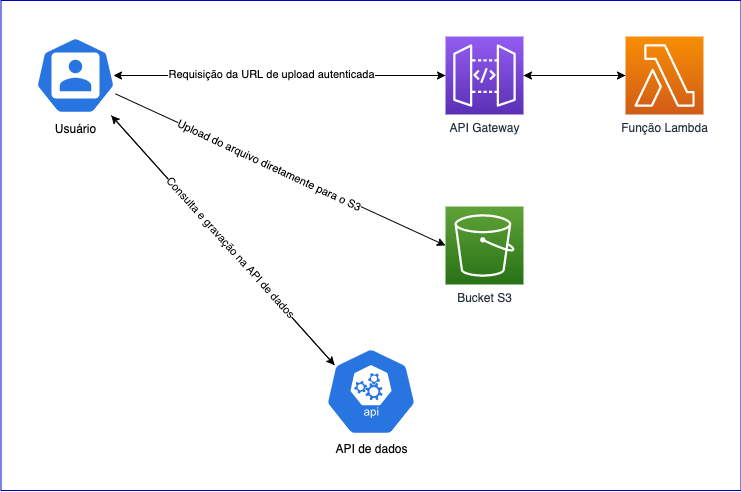

## Requisitos
- https://nodejs.org/ alternativamente você pode rodar um container docker do Node JS https://hub.docker.com/_/node

Para preparar a infraestrutura vamos seguir os seguintes passos:

## Criando o Bucket no S3
Crie um bucket padrão, sem acesso público ou outras permissões na região de sua escolha.

Este bucket será usado somente para receber os arquivos dos usuários, não deve ser usado para nenhuma outra 
finalidade.

Lembre-se de escolher um nome de bucket que esteja disponível na região que escolheu:
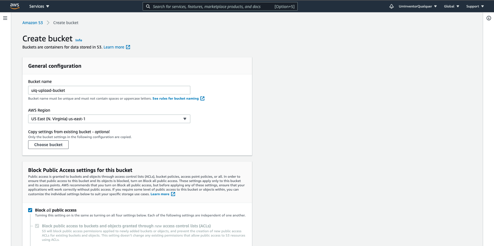

## Criando a função Lambda
Este função é responsável por gerar uma chave assinada no formato de URL, que será utilizada para fazer o upload 
do arquivo. Esta chave terá um tempo de expiração e será vinculada a um determinado tipo de arquivo, no caso do 
nosso exemplo, só aceitará arquivos do tipo JPEG pelo período de uma hora. Veja o arquivo fonte da função Lambda
em [lambda/uploader/index.js](../lambda/uploader/index.js).

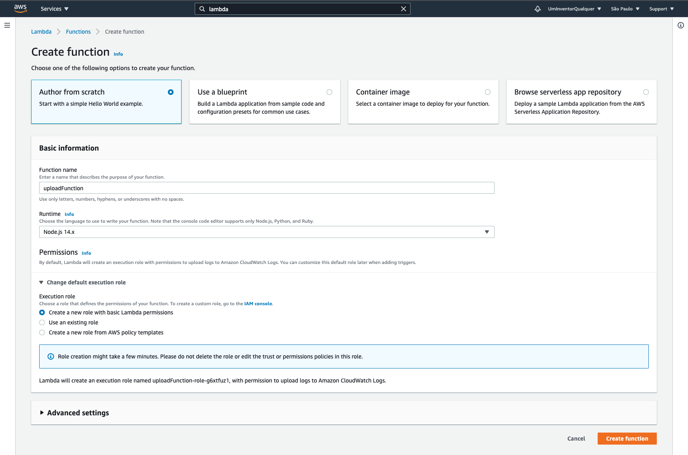

### Adicionando o código da função
Após criar a função você pode adicionar o conteúdo do arquivo [lambda/uploader/index.js](../lambda/uploader/index.js)
diretamente ao editor do painel de controle ou pode fazer upload da função compactada que se encontra no arquivo 
[lambda/uploader/uploader.zip](../lambda/uploader/uploader.zip). Para mais detalhes assista o vídeo.

Caso faça modificações na função e inclua outras bibliotecas, você pode utilizar o script 
[lambda/uploader/build.sh](../lambda/uploader/build.sh) para recriar o arquivo compactado e fazer o upload novamente.

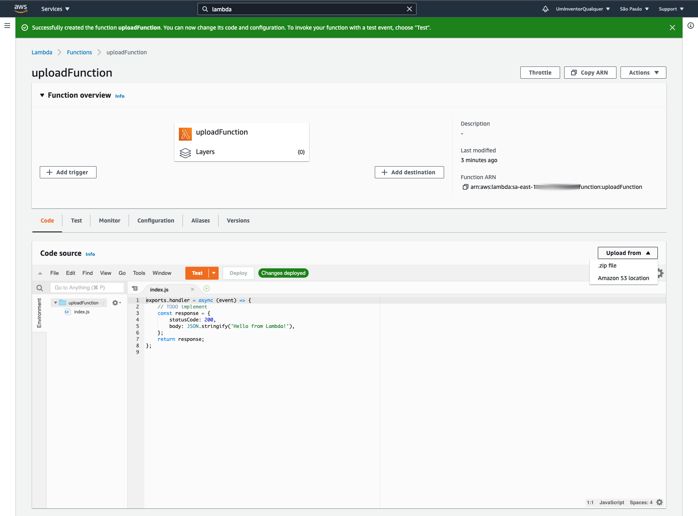
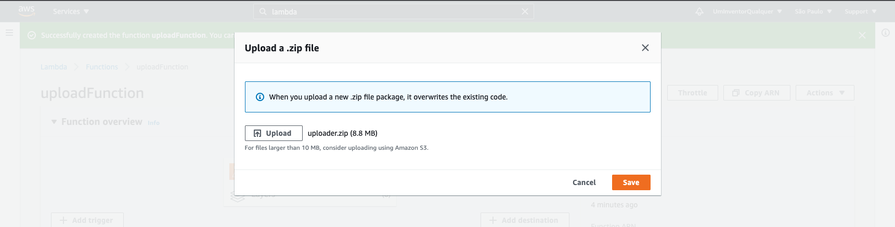

## Integrando sua função Lambda com o AWS API Gateway
Com sua função criada, clique no botão `add trigger` e selecione a opção `API Gateway`.

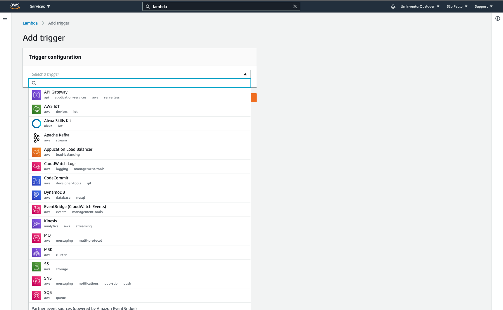

Na tela da trigger selecione `Create an API` e no API Type marque a opção `REST API`.

Em security, selecione a opção `Open` para que qualquer navegador possa fazer uma chamada para este end-point. Caso
Deseje utilizar esta funcionalidade em modo de produção, recomendo que adicione uma camada de autenticação integrada
a sua aplicação.

Em `API Name` digite `uploadAPI`.

Em `Development Stage` digite `dev`.

Agora é só clicar em `Add` para concluir a criação da trigger.

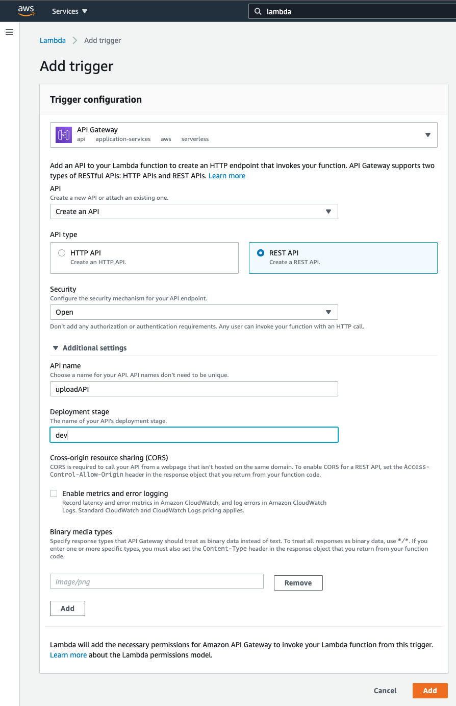

Após a criação da trigger entre a sua função Lambda e o API Gateway você deve copiar o end-point da API criada
e exportá-la como uma variável de ambiente juntamente com o nome do seu bucket, para que os scripts de teste
deste tutorial possam encontrá-los, assim como mostrado abaixo.

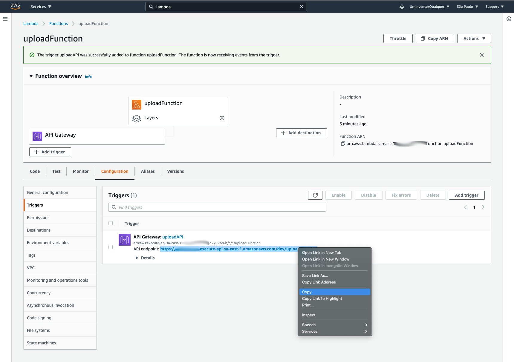

Em seu terminal Linux/MacOS rode os seguintes comandos substituindo os valores respectivamente pelo end-point da sua 
API criada pela trigger e pelo nome do bucket criado no primeiro passo:
```shell
export APIUPLOAD=https://XXXXXXXXXX.execute-api.us-east-1.amazonaws.com/dev/uploadFunction
export UPLOAD_BUCKET=uiq-upload-bucket
```

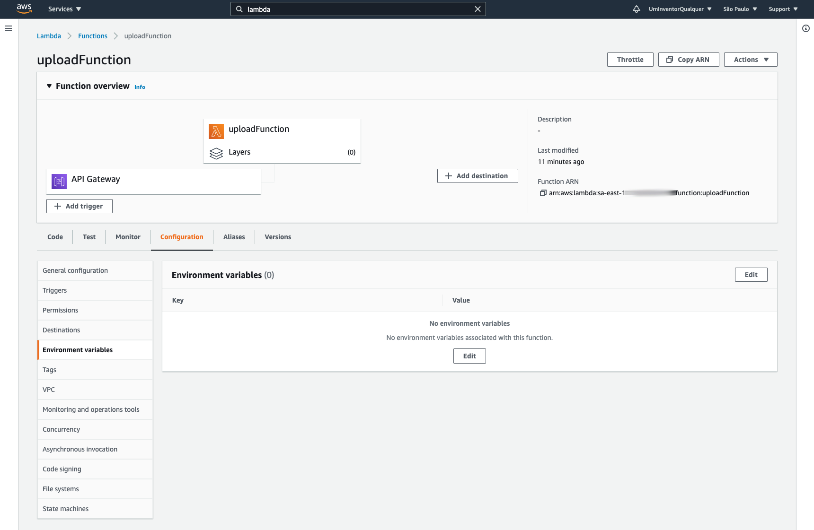

## Variáveis de ambiente da função Lambda

Nesta etapa nós vamos criar as variáveis de ambiente para passar os parâmetros para a nossa função Lambda, dessa 
forma não é necessário fazer um novo deploy caso algo mude na infra-estrutura, é possível fazer as alterações
de forma automatizada.

No menu esquerdo clique na opção `Environment Variables`, em seguida clique em `Edit`.

Vamos criar uma variável chamada `UPLOAD_BUCKET` que irá conter o nome do bucket criado na primeira etapa deste tutorial.

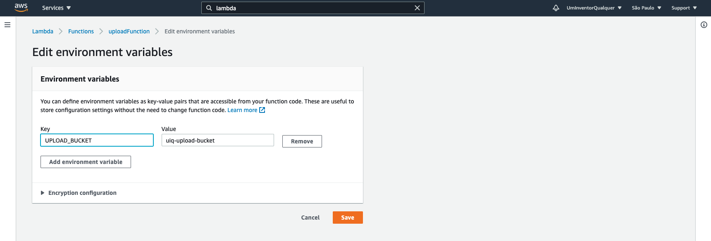

## Permissões da função Lambda

Para que a pre-signed URL possa gravar objetos dentro do bucket é necessário que a role criada automaticamente para
a função lambda receba a permissão adequada.

No menu da esquerda clique no item `Permissions` em seguida clique sobre o nome da Role na seção `Execution Role`
para abrir uma nova aba com seu painel do IAM.

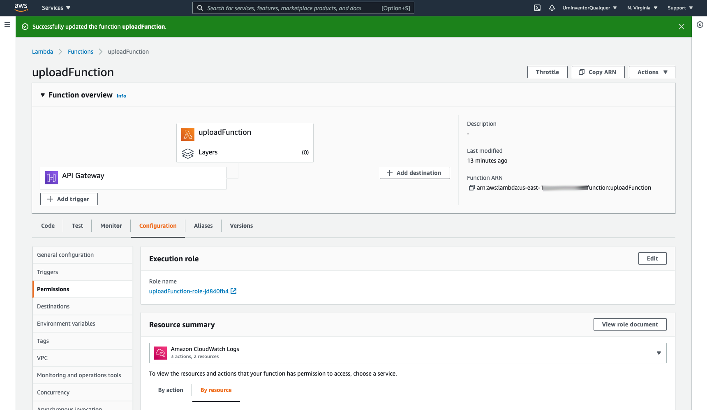

Na nova aba clique sobre o botão `Attach policies`.

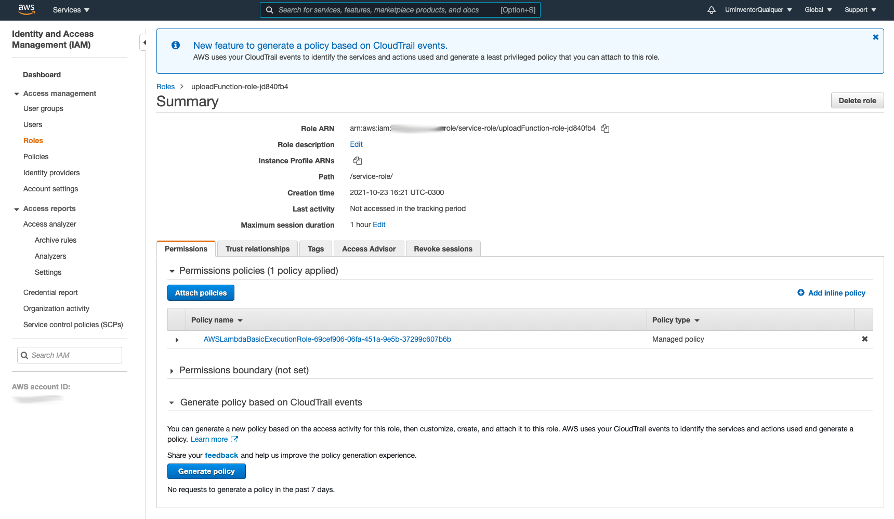

Na listagem de policies clique sobre o botão `Create Policy`.

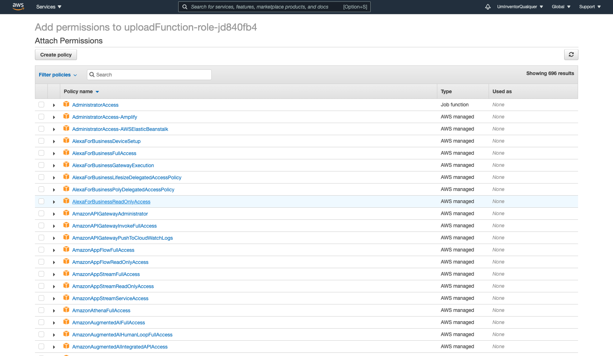

Na tela de criação de políticas de segurança, insira os seguintes dados nos respectivos campos:

- Service: `S3`
- Actions: `PutObject`
- Resources: Clique em `Edit` e informe o nome do bucket, e marque `any` no campo objects.

Prossiga para a próxima tela.

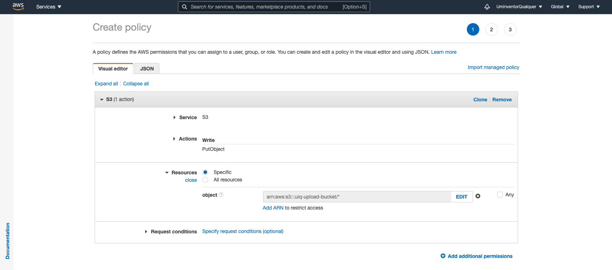

Dê um nome para a política de segurança, aqui nós vamos chamar de `lambdaUploadPolicy`.

Prossiga para a próxima tela e conclua a criação da política de segurança.

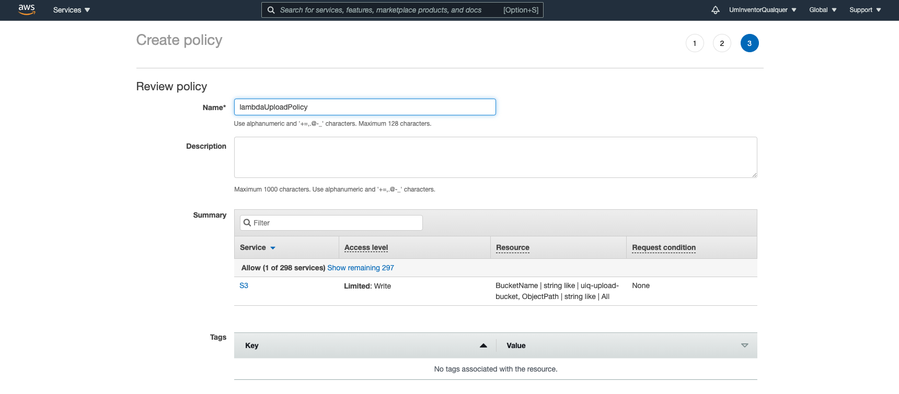

De volta à tela de inclusão das políticas, insira no campo de busca o nome da política recém criada `lambdaUploadPolicy`,
selecione e clique em `Add`.

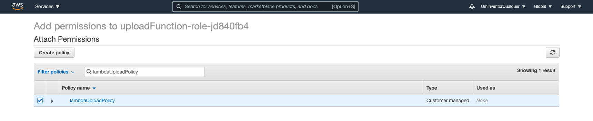

Pronto, agora sua função Lambda terá permissão para criar arquivos no seu bucket de upload.

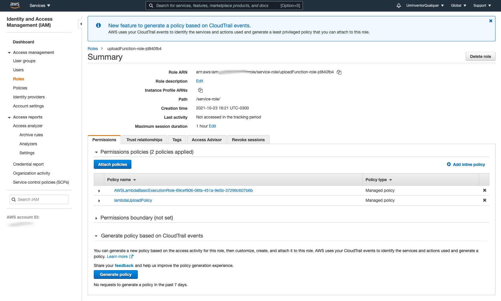

## Criando um usuário para sua aplicação consumir os arquivos e processá-los

Esta etapa pode ser substituída por outra função lambda ou um worker que fará o trabalho de processamento destes
arquivos. No nosso exemplo vamos assumir que a API fará esse trabalho ao receber a requisição do usuário após o 
upload.

Para isso acesse o seu painel do IAM, no menu da esquerda clique no item `Users` e em seguida clique no botão 
`Add Users` no lado superior direito da tela.

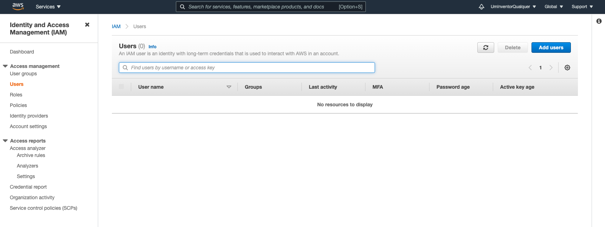

No campo `User name` insira `api`.
Marque a opção `Access key - Programatic access`.

Prossiga para a próxima tela.

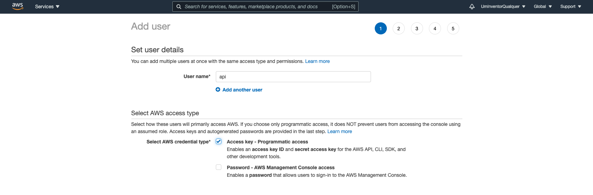

Na tela de permissões selecione a opção `Attach existing policies directly` e em seguida clique em `Create policy`.

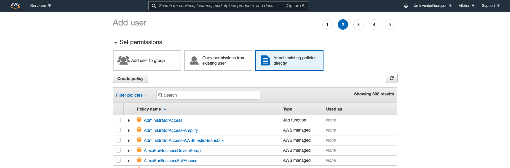

Na tela de criação de política insira os seguintes dados nos respectivos campos:

- Service: `S3`
- Actions: `ListBucket`, `GetObject` e `DeleteObject`
- Resources: Clique em Edit nas opções bucket e object e insira o nome do bucket criado na primeira etapa, e no 
campo object selecione `any`. 

Prossiga para a próxima página.

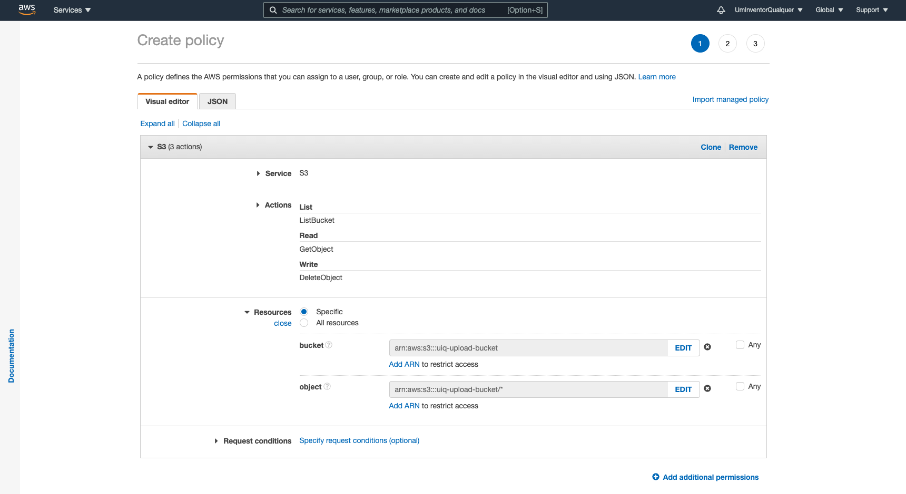

No campo name insira `apiS3UploadPolicy`.

Prossiga para a próxima página.

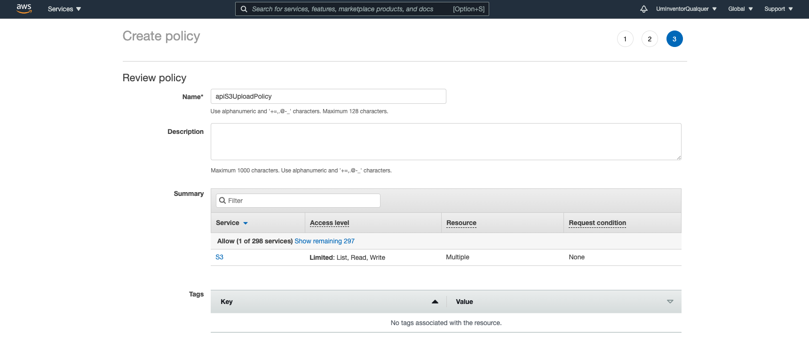

De volta a tela de políticas de segurança do usuário busque por `apiS3UploadPolicy` selecione e siga para a próxima 
página.

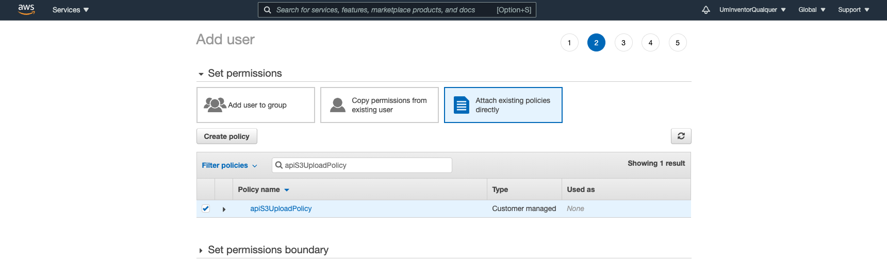

Revise os dados do usuário e conclua sua criação.

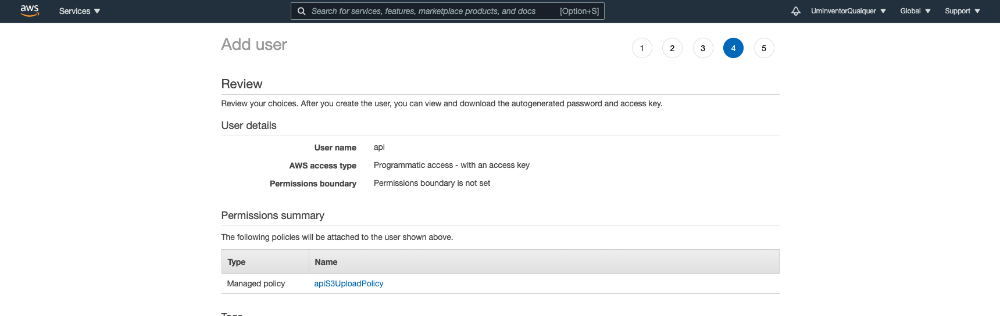

Salve as credenciais do usuário em seu arquivo `~/.aws/credentials` da seguinte forma substituindo os valores 
pelos dados de acesso do usuário que você acabou de criar:

```shell
[tutorials3]
aws_access_key_id = XXXXXXXXXXXXXXXXXXXX
aws_secret_access_key = XXXXXXXXXXXXXXXXXXXXXXXXXXXXXXXXXXXXXXXX
```

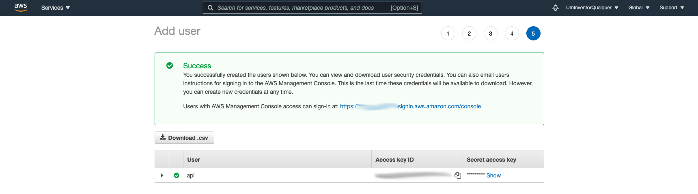


## Execução e teste

Agora que toda infra-estrutura está preparada vamos executar os scripts de teste.

Dentro da pasta do projeto entre na pasta `scripts` onde você encontrará os arquivos `upload.js` e `api.js`.

- `upload.js`: Este script é responsável por enviar as fotos da pasta `scripts/files/` para o S3 utilizando a URL 
pré-assinada.
- `api.js`: Este script irá simular sua aplicação, que será responsável por baixar e processar os arquivos do seu bucket
de upload. O arquivo baixado será salvo na pasta `scripts/downloads/` e você poderá verificar a integridade do mesmo.

## E agora?

Agora abra os scripts no seu editor preferido, analise, entenda o que eles fazem, modifique, brinque e descubra 
como é fácil passar a usar essa metodologia em suas aplicações e torná-la mais escalável, segura e rápida.

Não se esqueça de se inscrever no nosso canal do YouTube 
[Um Inventor Qualquer](https://www.youtube.com/c/UmInventorQualquer).

Um grande abraço e, até a próxima!

Wesley Milan

